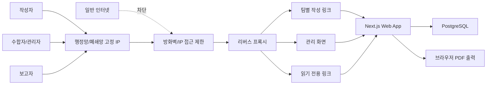

# 격주 업무보고 수합판 기술스펙

## 1. 기술 방향

이 문서는 `업무보고_수합판_PRD.md`를 기준으로 MVP 구현에 필요한 기술 결정을 확정한다.

제품의 핵심은 문서 편집기가 아니라 업무보고 데이터를 입력, 복사, 수합, 미리보기, PDF 출력하는 내부 웹앱이다. 따라서 첫 버전은 복잡한 문서 편집 기능보다 안정적인 데이터 입력 흐름, 자동 저장, 상태 관리, 출력 품질에 집중한다.

## 2. 확정 기술 스택

### 2.1 애플리케이션

- 프레임워크: Next.js App Router
- 언어: TypeScript
- UI: React, Tailwind CSS, shadcn/ui, lucide-react
- 폼 처리: React Hook Form
- 검증: Zod
- 서버 API: Next.js Route Handlers 또는 Server Actions
- 날짜 처리: date-fns

선정 이유:

- 입력 화면, 현황판, 읽기 전용 공유 화면, PDF 출력 화면을 하나의 앱에서 빠르게 구현할 수 있다.
- 서버 렌더링과 API를 같은 코드베이스에서 다룰 수 있어 MVP 개발 범위가 작다.
- PDF 출력에 필요한 인쇄 전용 화면 구성이 쉽다.

### 2.2 데이터베이스

- 운영 DB: PostgreSQL
- 로컬 개발 DB: Docker Compose 기반 PostgreSQL
- ORM: Prisma 6.x
- 마이그레이션: Prisma Migrate

선정 이유:

- 다중 사용자 자동 저장, 제출 상태, 읽기 링크 토큰을 안정적으로 관리할 수 있다.
- 추후 검색, 변경 이력, 조직도 연동으로 확장하기 쉽다.
- SQLite보다 운영 배포와 백업 전략을 명확하게 가져갈 수 있다.

### 2.3 인증 및 권한

MVP에서는 조직도 연동 없이 내부용 단순 권한으로 시작하되, 서비스 접근 자체는 행정망 또는 폐쇄망 고정 IP에서만 허용한다.

- 관리자: 관리자 계정 로그인
- 작성자: 팀별 작성 링크 토큰
- 읽기 전용 사용자: 회차별 읽기 링크 토큰

접근 제한:

- 일반 인터넷에서는 접속할 수 없도록 배포한다.
- 방화벽 또는 리버스 프록시에서 허용된 행정망 고정 IP만 접근시킨다.
- 애플리케이션에서도 Next.js Proxy에서 요청 IP를 검사해 허용 IP가 아니면 차단한다.
- 팀별 작성 링크와 읽기 전용 링크는 허용 IP 내부에서만 유효하다.

권한 모델:

- 관리자만 팀, 회차, 상태, PDF 최종 출력을 관리한다.
- 작성자는 본인이 받은 팀별 작성 링크로 해당 팀의 보고만 작성한다.
- 읽기 전용 사용자는 회차별 공유 링크로 보고서 조회와 PDF 다운로드만 가능하다.

첫 버전에서는 개인별 사용자 계정, 팀장 승인, 부서별 세부 권한, 조직도 연동을 구현하지 않는다.

### 2.4 PDF 출력

- 1차 방식: 브라우저 인쇄 기반 PDF 출력
- 구현: 보고서 미리보기 화면에 `@media print` 전용 스타일 제공
- 관리자와 읽기 전용 화면 모두 PDF 다운로드 버튼 제공

MVP에서는 서버에서 PDF 파일을 생성해 저장하지 않는다. 사용자가 현재 보고서 화면을 PDF로 저장한다.

후속 검토:

- 출력 품질 고정이 필요하면 Playwright 기반 서버 사이드 PDF 생성을 추가한다.
- HWP, Word 출력은 MVP 제외 범위를 유지한다.

### 2.5 배포

- 확정 배포: 행정망 또는 폐쇄망 내 고정 IP 서버 1대에 Docker Compose로 배포
- 구성:
  - web: Next.js 애플리케이션
  - db: PostgreSQL
- 환경 변수:
  - `DATABASE_URL`
  - `SESSION_SECRET`
  - `ADMIN_EMAIL`
  - `ADMIN_INITIAL_PASSWORD`
  - `APP_BASE_URL`
  - `ALLOWED_IP_RANGES`
  - `TRUSTED_PROXY_IPS`

MVP에서는 Supabase, Neon 같은 외부 관리형 PostgreSQL 서비스를 사용하지 않는다. 데이터베이스는 애플리케이션과 같은 행정망 또는 폐쇄망 배포 단위에서 운영한다.

클라우드 배포, 관리형 DB, 사내 SSO 연동은 MVP 이후 운영 부담이나 보안 정책에 따라 다시 검토한다. 일반 인터넷 공개 배포는 MVP 범위에서 제외한다.

### 2.6 네트워크 보안

접근 제어는 네트워크 계층과 애플리케이션 계층을 함께 사용한다.

1차 방어:

- 서버 방화벽에서 허용된 행정망 고정 IP 또는 대역만 `80/443` 포트 접근을 허용한다.
- PostgreSQL 포트는 외부에 공개하지 않고 Docker 내부 네트워크에서만 접근한다.
- 서버 관리 포트는 운영 담당자 IP에서만 접근시킨다.

2차 방어:

- 리버스 프록시에서 허용 IP가 아닌 요청을 차단한다.
- Next.js Proxy에서 `ALLOWED_IP_RANGES` 기준으로 요청 IP를 다시 검사한다.
- 프록시 뒤에서 운영할 경우 `TRUSTED_PROXY_IPS`에 등록된 프록시가 전달한 원본 IP만 신뢰한다.

차단 정책:

- 허용되지 않은 IP는 모든 화면과 API에서 `403 Forbidden`으로 응답한다.
- 관리자 로그인 화면도 허용 IP가 아니면 노출하지 않는다.
- 읽기 전용 공유 링크도 허용 IP가 아니면 조회할 수 없다.

## 3. 시스템 구성

## 4. 주요 화면

### 4.1 관리자 메인 현황 화면

경로: `/admin`

기능:

- 현재 회차 선택
- 보고 기간, 작성 마감일 표시
- 전체 제출률 표시
- 팀별 작성 상태 목록 표시
- 보고서 미리보기 이동
- 팀 관리, 회차 관리 이동

### 4.2 팀 관리 화면

경로: `/admin/teams`

기능:

- 팀 추가
- 팀명 수정
- 표시 순서 변경
- 사용 여부 변경
- 팀별 작성 링크 재발급

### 4.3 회차 관리 화면

경로: `/admin/cycles`

기능:

- 회차 생성
- 보고 제목, 기간, 마감일 수정
- 회차 상태를 작성 중 또는 완료로 변경
- 읽기 전용 링크 생성 또는 재발급

### 4.4 팀별 작성 화면

경로: `/write/[teamToken]/[cycleId]`

기능:

- 팀명과 회차 정보 표시
- 지난 회차 내용 불러오기
- 업무 항목 추가, 수정, 삭제
- 자동 저장
- 제출
- 제출 후 수정

### 4.5 수합 현황판

경로: `/admin/cycles/[cycleId]/status`

기능:

- 팀별 작성 여부 표시
- 제출 여부 표시
- 항목 수 표시
- 최종 수정 시간 표시
- 상태 변경

### 4.6 보고서 미리보기 화면

경로: `/admin/cycles/[cycleId]/preview`

기능:

- 보고 제목 표시
- 보고 기간 표시
- 팀 표시 순서대로 보고 내용 표시
- 빈 팀 또는 빈 항목 처리
- 인쇄용 레이아웃 제공
- PDF 출력

### 4.7 읽기 전용 공유 화면

경로: `/r/[shareToken]`

기능:

- 보고서 조회
- 팀별 내용 확인
- PDF 다운로드
- 수정 기능 없음

## 5. 데이터 모델

### 5.1 Team

| 필드 | 타입 | 설명 |
| --- | --- | --- |
| id | uuid | 팀 ID |
| name | text | 팀명 |
| displayOrder | int | 표시 순서 |
| isActive | boolean | 사용 여부 |
| writeTokenHash | text | 팀별 작성 토큰 해시 |
| createdAt | datetime | 생성 시각 |
| updatedAt | datetime | 수정 시각 |

### 5.2 ReportCycle

| 필드 | 타입 | 설명 |
| --- | --- | --- |
| id | uuid | 회차 ID |
| title | text | 보고 제목 |
| startDate | date | 보고 시작일 |
| endDate | date | 보고 종료일 |
| dueDate | date | 작성 마감일 |
| status | enum | `draft`, `completed` |
| shareTokenHash | text | 읽기 전용 공유 토큰 해시 |
| createdAt | datetime | 생성 시각 |
| updatedAt | datetime | 수정 시각 |

### 5.3 ReportEntry

| 필드 | 타입 | 설명 |
| --- | --- | --- |
| id | uuid | 팀별 보고 ID |
| reportCycleId | uuid | 회차 ID |
| teamId | uuid | 팀 ID |
| status | enum | `not_started`, `in_progress`, `submitted`, `needs_revision`, `completed` |
| submittedAt | datetime nullable | 제출 시각 |
| createdAt | datetime | 생성 시각 |
| updatedAt | datetime | 수정 시각 |

제약:

- `reportCycleId + teamId`는 유일해야 한다.
- 작성자가 처음 화면에 진입하면 해당 팀의 `ReportEntry`가 없을 경우 자동 생성한다.

### 5.4 WorkItem

| 필드 | 타입 | 설명 |
| --- | --- | --- |
| id | uuid | 업무 항목 ID |
| reportEntryId | uuid | 팀별 보고 ID |
| title | text | 업무명 |
| description | text | 지난 업무 실적 |
| nextPlan | text | 다음 주 계획 |
| note | text nullable | 비고 |
| displayOrder | int | 표시 순서 |
| createdAt | datetime | 생성 시각 |
| updatedAt | datetime | 수정 시각 |

### 5.5 AdminUser

| 필드 | 타입 | 설명 |
| --- | --- | --- |
| id | uuid | 관리자 ID |
| email | text | 로그인 이메일 |
| passwordHash | text | 비밀번호 해시 |
| createdAt | datetime | 생성 시각 |
| updatedAt | datetime | 수정 시각 |

### 5.6 Session

| 필드 | 타입 | 설명 |
| --- | --- | --- |
| id | uuid | 세션 ID |
| adminUserId | uuid | 관리자 ID |
| tokenHash | text | 세션 토큰 해시 |
| expiresAt | datetime | 만료 시각 |
| createdAt | datetime | 생성 시각 |

## 6. 상태 정의

### 6.1 회차 상태

- `draft`: 작성 중
- `completed`: 완료

완료된 회차는 관리자만 다시 작성 중으로 되돌릴 수 있다.

### 6.2 팀별 보고 상태

- `not_started`: 작성 전
- `in_progress`: 작성 중
- `submitted`: 제출 완료
- `needs_revision`: 수정 필요
- `completed`: 완료

상태 전환:

- 작성자가 저장하면 `not_started`에서 `in_progress`로 변경된다.
- 작성자가 제출하면 `submitted`로 변경된다.
- 관리자가 수정 요청하면 `needs_revision`으로 변경된다.
- 관리자가 확인 완료하면 `completed`로 변경된다.
- 제출 후 작성자가 수정하면 `submitted` 또는 `completed` 상태는 `in_progress`로 되돌린다.

## 7. 핵심 기능 설계

### 7.1 자동 저장

- 업무 항목 입력 후 1초 내외 디바운스로 저장한다.
- 저장 중, 저장됨, 저장 실패 상태를 화면에 표시한다.
- 저장 실패 시 재시도 버튼을 제공한다.
- 자동 저장은 항목 단위로 처리한다.

### 7.2 지난 회차 복사

동작:

1. 현재 회차 이전의 가장 최근 회차를 찾는다.
2. 같은 팀의 `ReportEntry`와 `WorkItem`을 조회한다.
3. 현재 회차에 항목이 없을 때는 전체 복사한다.
4. 현재 회차에 항목이 있으면 덮어쓰기 여부를 확인한다.
5. 복사된 항목은 현재 회차의 새 `WorkItem`으로 생성한다.

정책:

- 제출 상태는 복사하지 않는다.
- 복사 후 상태는 `in_progress`로 둔다.
- 항목별 삭제와 수정이 가능해야 한다.

### 7.3 제출

- 작성자는 제출 버튼을 누를 수 있다.
- 제출 시 업무명 또는 지난 업무 실적 중 하나 이상이 있는 업무 항목이 1개 이상 있어야 한다.
- 제출 후에도 수정 가능하다.
- 제출 후 수정이 발생하면 최종 수정 시간이 갱신된다.

### 7.4 빈 팀 및 빈 항목 처리

보고서 미리보기에서는 팀 표시 순서를 유지한다.

- 작성 전 팀: 팀명 아래에 `작성 전` 표시
- 작성 중이지만 항목 없음: `입력된 업무 항목 없음` 표시
- 빈 필드: 해당 줄을 숨기거나 `-`로 표시하지 않고 자연스럽게 생략

### 7.5 PDF 출력

- 미리보기 화면과 읽기 전용 화면은 동일한 보고서 컴포넌트를 사용한다.
- 화면용 UI 버튼은 인쇄 시 숨긴다.
- A4 세로 기준으로 여백, 제목, 팀 섹션, 항목 간격을 별도 CSS로 정의한다.
- PDF 파일명 권장 형식: `격주_업무보고_YYYY-MM-DD_YYYY-MM-DD.pdf`

## 8. API 설계

모든 API는 허용된 행정망 또는 폐쇄망 IP에서만 호출할 수 있다. IP 제한은 관리자 API뿐 아니라 작성자 API, 읽기 전용 API에도 동일하게 적용한다.

### 8.1 관리자 인증

- `POST /api/admin/login`
- `POST /api/admin/logout`
- `GET /api/admin/me`

### 8.2 팀

- `GET /api/admin/teams`
- `POST /api/admin/teams`
- `PATCH /api/admin/teams/[teamId]`
- `POST /api/admin/teams/[teamId]/rotate-write-token`

### 8.3 회차

- `GET /api/admin/cycles`
- `POST /api/admin/cycles`
- `GET /api/admin/cycles/[cycleId]`
- `PATCH /api/admin/cycles/[cycleId]`
- `POST /api/admin/cycles/[cycleId]/rotate-share-token`

### 8.4 팀별 보고

- `GET /api/write/[teamToken]/cycles/[cycleId]`
- `POST /api/write/[teamToken]/cycles/[cycleId]/copy-previous`
- `PATCH /api/write/[teamToken]/entries/[entryId]`
- `POST /api/write/[teamToken]/entries/[entryId]/submit`

### 8.5 업무 항목

- `POST /api/write/[teamToken]/entries/[entryId]/items`
- `PATCH /api/write/[teamToken]/items/[itemId]`
- `DELETE /api/write/[teamToken]/items/[itemId]`
- `PATCH /api/write/[teamToken]/entries/[entryId]/items/reorder`

### 8.6 보고서 조회

- `GET /api/admin/cycles/[cycleId]/report`
- `GET /api/read/[shareToken]/report`

## 9. 유효성 규칙

### 9.1 팀

- 팀명은 필수다.
- 같은 이름의 활성 팀은 중복 생성하지 않는다.
- 표시 순서는 1 이상 정수다.

### 9.2 회차

- 제목은 필수다.
- 보고 시작일은 종료일보다 늦을 수 없다.
- 작성 마감일은 필수다.
- 완료 상태의 회차도 조회와 PDF 출력은 가능하다.

### 9.3 업무 항목

- 업무명, 지난 업무 실적, 다음 주 계획, 비고는 모두 긴 텍스트 입력을 허용한다.
- 완전히 빈 항목은 저장하지 않거나 삭제 대상으로 처리한다.
- 제출 시 유효한 업무 항목이 1개 이상 필요하다.

## 10. UI 원칙

- 첫 화면은 관리자 현황판으로 둔다.
- 작성자는 한 화면에서 팀 보고 작성과 제출을 끝낼 수 있어야 한다.
- 입력 필드는 업무명, 지난 업무 실적, 다음 주 계획, 비고만 제공한다.
- 보고서 미리보기는 실제 업무보고 양식처럼 `지난 업무 실적`과 `다음 주 계획`을 좌우 2단 표로 표시한다.
- 작성 화면은 표 삽입 UI를 제공한다.
- 표 삽입 UI에서는 행 추가, 행 삭제, 열 추가, 열 삭제, 셀 입력을 지원한다.
- Excel에서 복사한 셀 범위는 표 편집기에 붙여넣어 사용할 수 있다.
- 자동 저장 상태는 항상 보이되 방해되지 않게 표시한다.
- 미리보기는 실제 보고서와 최대한 비슷한 읽기 흐름을 제공한다.
- 내부 업무 도구이므로 장식적 랜딩 페이지는 만들지 않는다.
- 허용 IP가 아닌 사용자는 로그인 화면, 작성 화면, 읽기 전용 화면을 볼 수 없다.

## 11. 테스트 범위

### 11.1 단위 테스트

- 상태 전환 함수
- 지난 회차 복사 로직
- 유효성 검증 스키마
- 팀 표시 순서 정렬

### 11.2 통합 테스트

- 회차 생성 후 팀별 보고 자동 생성
- 자동 저장 API
- 제출 API
- 지난 회차 복사 API
- 읽기 전용 토큰 조회
- 허용 IP 접근 성공
- 미허용 IP 접근 차단

### 11.3 화면 테스트

- 작성자가 지난 회차 복사 후 수정하고 제출할 수 있다.
- 수합자가 팀별 상태를 확인하고 변경할 수 있다.
- 보고서 미리보기에서 팀 순서와 빈 항목 처리가 올바르다.
- 인쇄 화면에서 버튼과 입력 UI가 보이지 않는다.

권장 도구:

- Vitest
- Testing Library
- Playwright

## 12. 개발 단계

### 12.1 1단계: 기반 구축

- Next.js 프로젝트 생성
- Tailwind CSS, shadcn/ui 설정
- Prisma, PostgreSQL 설정
- IP 접근 제한 Proxy 구현
- 관리자 로그인 구현

### 12.2 2단계: 관리 기능

- 팀 목록 관리
- 회차 생성 및 수정
- 회차별 팀 보고 엔트리 자동 생성

### 12.3 3단계: 작성 기능

- 팀별 작성 링크
- 업무 항목 CRUD
- 자동 저장
- 제출
- 지난 회차 복사

### 12.4 4단계: 수합 및 미리보기

- 수합 현황판
- 상태 변경
- 보고서 미리보기
- 읽기 전용 공유 화면

### 12.5 5단계: 출력 및 마감

- 인쇄 전용 CSS
- PDF 다운로드 흐름
- 기본 테스트 작성
- Docker Compose 배포 설정

## 13. MVP 완료 기준

- 관리자가 팀을 추가하고 순서를 바꿀 수 있다.
- 관리자가 회차를 만들고 마감일을 설정할 수 있다.
- 작성자가 팀별 링크로 접속해 업무 항목을 작성할 수 있다.
- 작성 내용이 자동 저장된다.
- 작성자가 지난 회차 내용을 복사할 수 있다.
- 작성자가 제출할 수 있다.
- 수합자가 팀별 작성 상태를 한 화면에서 확인할 수 있다.
- 수합자가 보고서 미리보기를 볼 수 있다.
- 보고자가 읽기 전용 링크로 현재 보고서를 볼 수 있다.
- 보고서를 PDF로 저장할 수 있다.

## 14. 의사결정 완료 항목

- MVP는 웹앱으로 구현한다.
- 일반 인터넷 공개 배포는 하지 않는다.
- 행정망 또는 폐쇄망 고정 IP에서만 접근 가능하도록 배포한다.
- 방화벽, 리버스 프록시, 애플리케이션 Proxy에서 IP 접근 제한을 적용한다.
- HWP, Word, 첨부파일, 댓글, 알림, AI 기능은 제외한다.
- 데이터 저장은 자체 운영 PostgreSQL을 사용한다.
- PostgreSQL은 Docker Compose로 애플리케이션과 함께 배포한다.
- MVP에서는 Supabase, Neon 등 외부 관리형 DB를 사용하지 않는다.
- 팀별 작성은 링크 토큰 방식으로 시작한다.
- 읽기 전용 공유도 링크 토큰 방식으로 시작한다.
- PDF는 브라우저 인쇄 기반으로 시작한다.
- 서버 사이드 PDF, SSO, 조직도 연동은 후속 검토로 둔다.

## 15. 남은 확인 항목

아래 항목은 구현 전에 한 번만 확인하면 된다.

- 실제 배포 서버 환경: 행정망 Windows 서버, Linux 서버, NAS 중 어디인지
- 허용할 행정망 고정 IP 또는 IP 대역
- 리버스 프록시 사용 여부와 프록시 서버 IP
- 예상 팀 수와 동시 작성자 수
- 관리자 계정 수: 1명인지 여러 명인지
- PDF 출력 양식: 기존 HWP와 얼마나 비슷해야 하는지
- 읽기 전용 링크 접근 범위: 행정망 또는 폐쇄망 내부로 제한한다는 정책의 세부 범위
